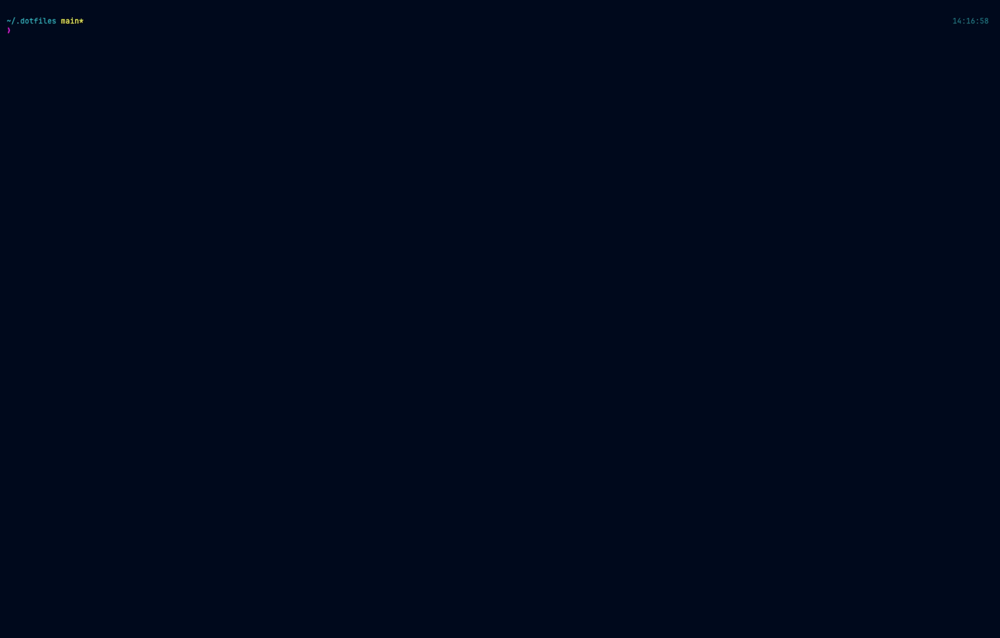
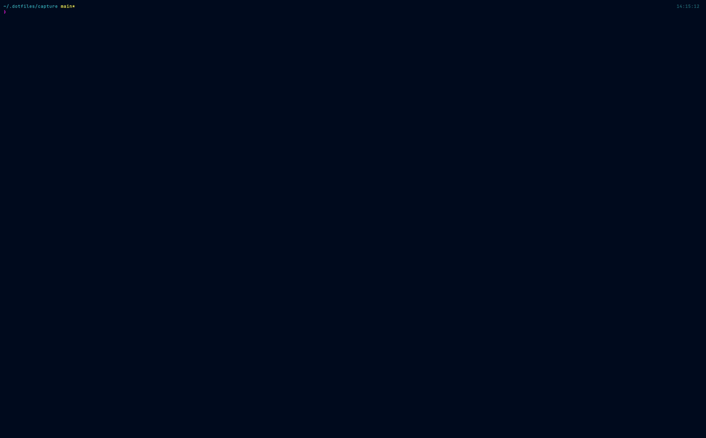
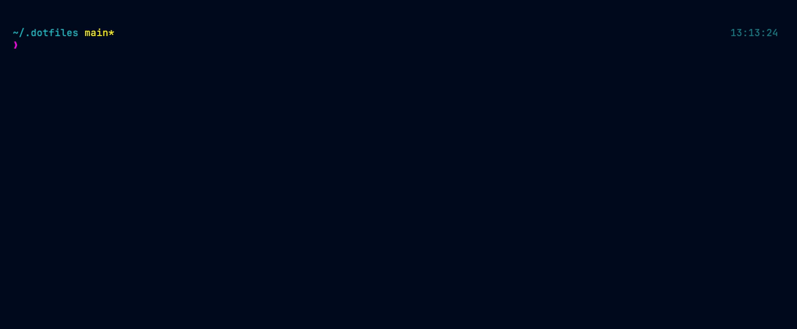

<div align="center">

# CYBERDECK

**A cyberpunk rice of macOS and Fedora — tiling, bar, terminal, shell and a live system HUD.**

Cyberpunk Neon across AeroSpace/niri, SketchyBar/Waybar, Ghostty, zsh, tmux,
btop, bat, delta, fastfetch and Zed — from one palette, in one repo.

*SIP stays enabled. Nothing here asks you to disable it.*



**[📖 Read the Field Manual](https://matthart1983.github.io/cyberdeck/)** — every
key, command and surface in one searchable page, macOS and Fedora side by side.

</div>

---

## The HUD

`hud` tiles four terminal monitors into one screen — [soundwatch](https://github.com/matthart1983/soundwatch),
[netwatch](https://github.com/matthart1983/netwatch), [syswatch](https://github.com/matthart1983/syswatch)
and [diskwatch](https://github.com/matthart1983/diskwatch): audio, network, system and disk,
all themed from the same palette. Four panes, one author.



## The shell



---

## What makes this one different

Most bars shell out to `netstat` and `ping` for their network readout. This one
doesn't. It's fed by [netwatch](https://github.com/matthart1983/netwatch)'s own
headless daemon over a Prometheus endpoint, so the bar shows **gateway RTT, DNS
RTT, packet loss and live connection count** — diagnostics, not decoration. See
[The bar](#the-bar).

## The Field Manual

Everything this rice binds, in one page you can search: the tiling keys, the
bar's items and where each one gets its data, the Ghostty and tmux bindings,
the shell aliases, and how to undo any of it.

It documents both platforms from one page. The **macOS / Fedora** switch in the
sidebar (or `t`) swaps AeroSpace for niri, SketchyBar for Waybar, and `cmd` for
`ctrl+shift` — everything the two halves genuinely share is written once, and
the `/` filter only ever searches the platform you're on. Your choice is
remembered.

**→ [matthart1983.github.io/cyberdeck](https://matthart1983.github.io/cyberdeck/)**

It ships with the repo too, so it works offline and without GitHub:

```sh
open ~/.dotfiles/docs/cyberdeck-manual.html     # macOS
xdg-open ~/.dotfiles/docs/cyberdeck-manual.html # Fedora
```

## Requirements

A Nerd Font on either platform (the configs ask for JetBrainsMono Nerd Font).

### macOS

macOS 13+. Homebrew.

```sh
# window layer
brew install --cask nikitabobko/tap/aerospace
brew tap felixkratz/formulae
brew trust felixkratz/formulae      # Homebrew gates this tap; sketchybar and
brew install sketchybar borders     # borders are upstreamed by its author

# terminal + shell layer
brew install --cask ghostty font-jetbrains-mono-nerd-font
brew install eza bat fd fzf zoxide atuin git-delta ripgrep fastfetch btop tmux jq

# the HUD's four panes (optional — hud degrades to whatever is installed)
cargo install netwatch-tui syswatch diskwatch
# soundwatch must be built with `make`, not cargo: the binary needs a bound
# Info.plist for macOS to prompt for audio consent, or every sample is zero.
git clone https://github.com/matthart1983/soundwatch && cd soundwatch && make build
```

`netwatch` is also what feeds the bar's network items. Without it the bar still
works; those two items read `netwatch off`.

### Fedora

Fedora 42+. Everything below is in Fedora's own repos:

```sh
# window layer
sudo dnf install niri waybar swaybg fuzzel wl-clipboard brightnessctl

# terminal + shell layer
sudo dnf install zsh zsh-autosuggestions zsh-syntax-highlighting
sudo dnf install eza bat fd-find fzf zoxide atuin git-delta ripgrep \
                 fastfetch btop tmux jq python3-pillow

# or just run the lot, plus the Framework/power bits
~/.dotfiles/linux/packages.sh
```

Three things Fedora does not package, and `packages.sh` deliberately will not
install behind your back:

- **Ghostty** — not in the repos, not on Fedora's filtered Flathub, and the
  only prebuilt binaries are third-party COPRs. So the rice builds it from
  upstream's signed source tarball instead:

  ```sh
  ~/.dotfiles/linux/ghostty.sh
  ```

  Sudo, once, for the GTK build dependencies; Ghostty itself lands in
  `~/.local` and leaves no root-owned files. The tarball's minisign signature
  is checked before anything is unpacked, and the Zig version is read out of
  the source that was just verified — Fedora ships two Zig minors and only one
  of them can build Ghostty. Budget a few minutes for the compile. Until you
  run it the rice works in any terminal; only `ghostty/config` goes unused.
- **powerlevel10k** — `git clone --depth=1 https://github.com/romkatv/powerlevel10k
  ~/.local/share/powerlevel10k`, then source it at the top of `~/.zshrc`.
- **JetBrainsMono Nerd Font** — drop the release zip in `~/.local/share/fonts`
  and run `fc-cache -f`.

`soundwatch` is macOS-only — it binds a CoreAudio tap. On Linux `hud` comes up
as a three-pane grid instead of four; the other three are the same cargo
installs.


## Install

```sh
git clone https://github.com/matthart1983/cyberdeck ~/.dotfiles
~/.dotfiles/install.sh
exec zsh
```

`install.sh` detects the platform, runs `common/install.sh`, then the matching
`macos/` or `linux/` half. It only symlinks and loads services — it is
idempotent and touches no system settings. Each platform's system layer is
separate and opt-in.

On Fedora that opt-in layer is `linux/packages.sh` (above). On macOS:

```sh
~/.dotfiles/macos/snapshot.sh    # record YOUR current state first — required
~/.dotfiles/macos/defaults.sh    # apply (refuses to run without a snapshot)
~/.dotfiles/macos/restore.sh     # undo, replaying the snapshot
```

The snapshot is machine-specific and deliberately not committed. `defaults.sh`
refuses to run until you have one, so the undo path can never be missing when
the apply path has run.

Then check your work:

```sh
rice-doctor      # every layer, exits non-zero if one is down
```

On macOS, **AeroSpace needs Accessibility permission granted by hand** the first
time (System Settings ▸ Privacy & Security ▸ Accessibility). Until it is, its
CLI reports "can't connect to AeroSpace server" even though the app is running,
and the bar's workspace indicators stay hidden. `rice-doctor` calls this out.

On Fedora there is no equivalent grant: log out, pick **niri** at the session
chooser, and it comes up with Waybar already running.

## Making it yours

This is one person's setup, published because the parts are worth stealing.
The pieces are independent: take the bar without the tiling, the HUD without
either, or just the Ghostty theme.

## Themes

Eight of them. One command moves all thirteen themed surfaces at once:

```sh
theme                 # what's active, and what else there is
theme blade           # tiling, bar, terminal, shell, tmux, editor, HUD, wallpaper
```

One command. It renders the thirteen surfaces, re-links them, reloads what can
be reloaded from outside, and tells you the two or three things that can't be —
Ghostty has no reload-from-CLI, and a shell's colours are fixed at start.

| Theme | Character |
|---|---|
| `cyberpunk-neon` | The rice as shipped. Cyan on navy, magenta accent. |
| `blood-dragon` | Hot pink on deep violet. Loudest of the eight. |
| `terminal-green` | Green phosphor, amber for bold. Closest to the metal. |
| `deep-sea` | Indigo hull, aqua readouts. Dark without the shouting. |
| `amber-crt` | One phosphor, one hue family. Red is the only outsider. |
| `ice` | Low chroma, cold whites. Instrumentation, not neon. |
| `blade` | Desaturated teal, rust accent. Built for eight-hour days. |
| `paper` | Warm off-white, ink foreground. The only light one. |

A palette is 41 colour slots of literal hex in `themes/<slug>.sh` — data, read
rather than sourced. Each themed surface is a `.tmpl` beside its output;
`theme` renders them. Nothing is mirrored by hand any more, which is the point:
eight themes across thirteen surfaces is 104 files that would drift with
nothing to catch it.

The rendered surfaces are tracked, so `theme blade && git diff` shows you
every surface that moved. Which theme you run is not: `themes/active.sh` is a
gitignored symlink, and a fresh clone falls back to the default.

**Full contract, and the two rules that matter — [`themes/README.md`](themes/README.md).**

## Palette

The default. `themes/cyberpunk-neon.sh` is the whole of it; `palette.sh` now
points at whichever theme is active, for the scripts that can read a shell
variable. The surfaces cannot, which is why they are rendered instead.

| Role | Hex |
|---|---|
| bg / bg-alt | `#000b1e` / `#091833` |
| fg / fg-dim | `#0abdc6` / `#0f7d84` |
| magenta (accent) | `#ea00d9` |
| purple | `#711c91` |
| blue | `#133e7c` |
| green / yellow | `#00ff9f` / `#f3e600` |
| orange / red | `#f57800` / `#ff0055` |

## Layout

The repo is split three ways: `common/`, `macos/`, `linux/`. Every path under
`common/` works identically on both platforms; the two platform directories
mirror each other, and each holds its own `install.sh` and `bin/rice-doctor`.

| Path | What |
|---|---|
| `palette.sh` | points at the active theme — what scripts source |
| **`themes/`** | |
| `themes/<slug>.sh` | one palette per theme: 41 slots of literal hex, no logic |
| `themes/README.md` | the slot contract, the contrast floors, and how to add one |
| `themes/active.sh` | gitignored symlink to whichever is in use |
| `install.sh` | dispatcher — runs `common/` then the platform half |
| `test/idempotent.sh` | runs the installer twice against a throwaway `$HOME` and fails if the second run writes anything |
| `test/theme.sh` | renders all 8 themes across all 13 surfaces and checks the contract, the drift and the contrast floors |
| **`common/`** | |
| `common/install.sh` | the symlinks and settings both platforms share |
| `common/lib.sh` | `link` / `copy` / `render` — the helpers that make a re-run a no-op |
| `common/ghostty/` | terminal config + `themes/cyberdeck`, plus `platform-{macos,linux}.conf` |
| `common/zsh/cyberpunk.zsh` | aliases, tool init, PATH, p10k colour overrides |
| `common/tmux/tmux.conf` | neon status bar, vim nav, tpm plugins |
| `common/bat/` | `cyberdeck.tmTheme` — also drives delta and fzf previews |
| `common/btop/themes/` | btop theme — btop is still themed, just not in the HUD |
| `common/fastfetch/` | config + ASCII logo |
| `common/zed/themes/` | Zed theme — neon chrome, desaturated syntax |
| `common/atuin/themes/` | atuin (ctrl-R) theme |
| `common/bin/theme` | the switcher — renders every themed surface from one palette |
| `common/bin/theme-render` | expands one `.tmpl` against one palette; four colour notations |
| `common/claude-settings.py` | patches Claude Code's theme + statusline, leaving your other settings alone |
| `common/zed-settings.py` | selects the Zed theme in `settings.json`, preserving its comments |
| `common/bin/hud` | four-pane dashboard |
| `common/bin/rice-doctor` | health check; dispatches to the platform half |
| `common/bin/cc-statusline` | Claude Code statusline: model, dir, git, context |
| `common/bin/tmux-battery` | battery glyph for the status bar |
| `common/bin/rice-capture` | render the demo tapes |
| **`macos/`** | |
| `macos/install.sh` | the macOS half — links, LaunchAgent, sketchybar |
| `macos/aerospace/` | tiling WM config — workspaces, keybinds, window rules |
| `macos/sketchybar/` | the bar: `sketchybarrc`, `colors.sh`, `icons.sh`, `plugins/` |
| `macos/launchd/` | LaunchAgent for the netwatch daemon that feeds the bar |
| `macos/bin/borders.sh` | JankyBorders launcher (magenta on focus) |
| `macos/bin/rice-doctor` | the macOS half of the health check |
| `macos/defaults.sh` | system settings apply + `snapshot.sh` / `restore.sh` |
| **`linux/`** | |
| `linux/install.sh` | the Fedora half — links, systemd unit, wallpaper |
| `linux/niri/` | tiling compositor config — the AeroSpace counterpart |
| `linux/waybar/` | the bar: `config.jsonc`, `style.css`, `scripts/` |
| `linux/systemd/` | user unit for the netwatch daemon |
| `linux/packages.sh` | package + firmware layer (opt-in, needs sudo) |
| `linux/ghostty.sh` | builds Ghostty from upstream's signed tarball into `~/.local` (opt-in) |
| `linux/bin/rice-doctor` | the Fedora half of the health check |
| **root** | |
| `capture/` | VHS tapes; GIFs land in `capture/out/` (gitignored) |
| `wallpaper/generate.py` | wallpaper generator (PIL, no numpy) |
| `attic/` | anything the installer displaced, under a per-run timestamp (gitignored) |

niri draws its own focus ring, so JankyBorders has no Linux counterpart —
that is one fewer daemon on the Fedora side, not a missing feature.

## Re-running the install

`install.sh` is idempotent, and that is tested rather than asserted:

```sh
test/idempotent.sh
```

It runs the real installer twice against a throwaway `$HOME` — with systemd,
launchd, brew and the bar stubbed out so a test can never bounce the live
daemon — and fails unless the second run reports zero writes *and* leaves a
byte-identical tree. Three fixtures: a fresh machine, one whose `~/.config`
already holds real directories where the rice wants symlinks, and one still on
the pre-restructure layout.

The themes have their own:

```sh
test/theme.sh
```

Eight palettes across thirteen surfaces is 104 renders nobody is going to check
by eye. It proves each palette actually *sets* its variables (a space before the
`=` makes it a command, which `bash -n` passes and which sets nothing), that
every palette fills the same contract in the same order, that every surface
renders with no unknown placeholder and no literal colour left behind, that the
tracked surfaces are exactly what the templates produce, that switching through
all eight themes and back restores the tree byte for byte, and that every slot
carrying text clears its contrast floor.

Nothing is ever overwritten in place. Whatever the installer displaces is moved
to `attic/<timestamp>/`, mirroring its path under `$HOME`.

## Commands

| Command | Does |
|---|---|
| `hud` | soundwatch + netwatch + syswatch + diskwatch in a tiled grid (`hud -r` rebuilds) |
| `fetch` | fastfetch with the CYBERDECK logo |
| `cmd + \`` | Ghostty quick-terminal dropdown |
| `prefix` = `C-a` | tmux prefix; `\|` and `-` split, `hjkl` navigate |
| `rice-doctor` | verify aerospace, borders, bar, netwatch feed, configs, secrets |
| `rice-capture` | render demo GIFs (`rice-capture hud` for just one) |
| `theme [slug]` | show or switch the palette — renders, re-links and reloads in one |
| `open`/`xdg-open docs/cyberdeck-manual.html` | the [field manual](https://matthart1983.github.io/cyberdeck/) — every key and command for both platforms, searchable |

## Window management

`alt` is the tiling modifier on macOS; **`super` on Fedora**. That is the one
deliberate divergence in the whole port: on Linux `alt`+letter is the GTK
mnemonic accelerator, so binding it here would make every app's menu bar
unreachable. Everything below reads the same with the modifier swapped.

| Keys | Does |
|---|---|
| `alt` + `hjkl` / arrows | focus |
| `alt shift` + `hjkl` / arrows | move window |
| `alt` + `1`–`9` | switch workspace |
| `alt shift` + `1`–`9` | send window to workspace, follow it |
| `alt` + `-` / `=` | resize · `alt shift =` balances |
| `alt` + `/` `,` | tiles / accordion layout |
| `alt` + `f` | float this window · `alt shift f` fullscreen |
| `alt` + `tab` | back-and-forth |
| `alt shift` + `r` | resize mode (`hjkl`, `b` balance, `esc` out) |
| `alt shift` + `;` | service mode — `r` reset tree, `f` float, `esc` reload config |

Workspaces: 1 term · 2 code · 3 web · 4 chat · 5 notes · 6 infra.
Apps land there automatically — `on-window-detected` rules on macOS,
`window-rule { open-on-workspace }` on Fedora.

Two keys mean something slightly different under niri, because it is a
*scrollable* tiler rather than a tree tiler: there is no tree to flatten and
no sizes to balance. `super /` cycles the preset column widths, `super ,`
toggles a tabbed column — niri's accordion. Both are annotated in
`linux/niri/config.kdl`.

## The bar

The two right-hand items are fed by **netwatch's own daemon**, not by
`netstat` or `ping`. A LaunchAgent runs `netwatch daemon --metrics`, which
serves Prometheus on `127.0.0.1:9464`; `plugins/netwatch_lib.sh` scrapes it
with a 1.5s ceiling so a sick daemon can never stall the bar.

| Item | Source |
|---|---|
| `link` | `netwatch_gateway_rtt_seconds`, `dns_rtt`, `loss_ratio`, `connections` — colours on the worst signal, goes red on any loss |
| `net` | `netwatch_interface_{receive,transmit}_bytes_per_second` on the default route |
| `cpu` / `mem` | `top` one-shot · `memory_pressure` (free RAM is meaningless on macOS) |
| `disk` | `/System/Volumes/Data` — `/` is the sealed snapshot and always reads 4% |
| workspaces | AeroSpace, repainted by `exec-on-workspace-change` |

No sudo: the daemon does interface counters and probes, not packet capture.
Cost measured at 0.4% CPU / 15MB RSS.

On Fedora the same two items are Waybar custom modules reading the same
endpoint, with the daemon under `systemctl --user` instead of launchd. The
other four items shrink to nothing there: `cpu`, `mem`, `disk` and `battery`
each needed a shell plugin on macOS only because `top`, `memory_pressure` and
`pmset` have to be parsed. Waybar reads all four out of `/proc` and `/sys`
itself, so `linux/waybar/scripts/` holds just the two netwatch ones — which
was always the part worth having.

## Notes

- Secrets live in `~/.config/secrets.zsh` (chmod 600), never in this repo.
- **macOS:** the menu bar is hidden now that SketchyBar replaces it. Undo with
  `defaults delete NSGlobalDomain _HIHideMenuBar`, or `macos/restore.sh`.
- **Fedora:** nothing equivalent to hide. Waybar declares its own exclusive
  zone, so niri gets out of its way — unlike AeroSpace's `outer.top`, which
  has to be hand-counted to clear the menu bar plus the bar.
- **Framework 13:** `linux/packages.sh` also installs `power-profiles-daemon`
  and refreshes firmware through `fwupd` — Framework ships BIOS over LVFS, so
  `sudo fwupdmgr update` is the whole update path. `rice-doctor` checks both,
  plus that `/sys/power/mem_sleep` is on `s2idle`, which is what the AMD boards
  want. The battery enumerates as `BAT1`, not `BAT0`; `bin/tmux-battery` and
  the Waybar battery module both account for that.
- **AeroSpace needs Accessibility permission granted by hand** on first run
  (System Settings ▸ Privacy & Security ▸ Accessibility). Until it is, the
  CLI reports "can't connect to AeroSpace server" even though the app is up,
  and the bar's workspace indicators stay hidden.
- SketchyBar and JankyBorders come from the `felixkratz/formulae` tap, which
  Homebrew requires you to `brew trust` before installing.
- tmux configs use literal hex; tmux has no shell variables.
- `bin/hud` uses named pane targets (`{left}`, `{top-right}`) because
  `pane-base-index` is 1.

## App layer

Zed keeps the neon UI chrome but uses **desaturated syntax colours** — code is
read for hours, chrome is glanced at. Both halves are in every palette: the
chrome slots, and the thirteen `CP_SOFT_*` ones that only syntax uses. The
installer selects the theme in Zed's `settings.json` too — linking the file
only puts it in Zed's picker.

Claude Code is set to the `dark-ansi` theme so it inherits the Ghostty ANSI
palette rather than duplicating it, plus a neon statusline from
`common/bin/cc-statusline`. That is also why every palette authors a full ANSI
bright half: `theme blade` has to move Claude Code with everything else, and it
only ever sees the terminal's sixteen colours.

## Captures

`rice-capture` renders `capture/*.tape` through VHS into `capture/out/`.

Two things the tapes have to work around:

- VHS points `ZDOTDIR` at its own temp rc, so `~/.zshrc` never loads and none
  of the rice exists. Each tape re-execs into a real interactive shell first.
- `hud.tape` needs a canvas over 160x50 cells, because all four tools refuse
  to draw below 80x24 and each gets a quarter of the screen.

## License

MIT — see [LICENSE](LICENSE).
